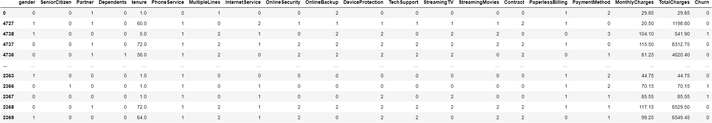
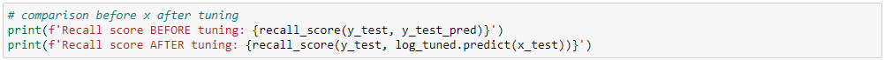
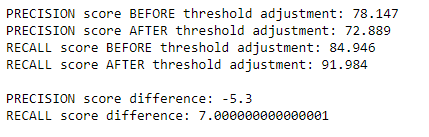
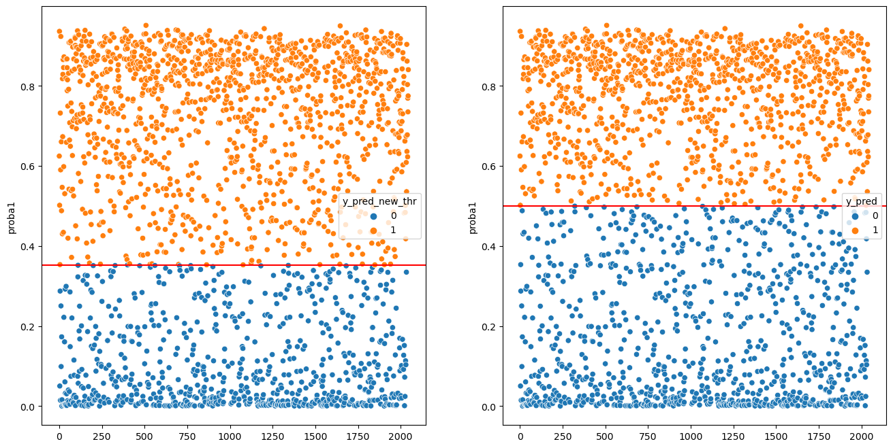
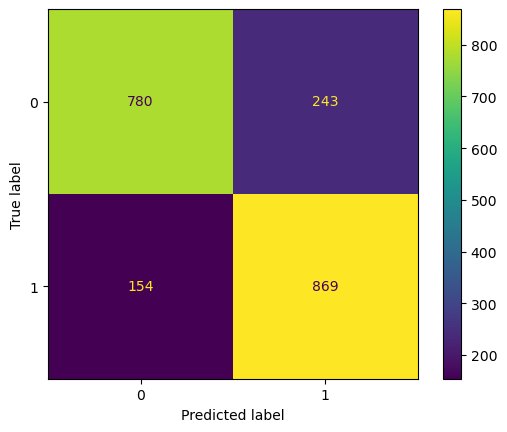
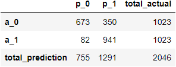

# CUSTOMER CHURN IN TELCO INDUSTRY

# INTRODUCTION

__Problem__:

Churn is the number of customers that don't return to your company after making a purchase. When it occurs, the company's revenue will decrease. When talking about revenue, we also talk about cost. There are promotional costs known as Acquisition Cost and Retention Cost. According to [outboundengine.com](https://www.outboundengine.com/blog/customer-retention-marketing-vs-customer-acquisition-), *acquiring a new customer can **cost five times more** than retaining an existing customer*. Also, increasing customer retention by 5% can increase profits from 25-95%. In other words, __it is better to prevent the churn than acquire new customers__.

Churn occurs in many industries including Telco industry. A high rate of churn will harm the business in the long term. Therefore, it is important to identify the customers who will churn so that the telco company can take action to prevent that. Due to human limitations in analyzing and predicting large amounts of data, machine learning is needed to predict the churn problem. predicting churn using machine learning also capable to help the company to allocate the cost as precise as possible.

The company could reach the customers for communication and ask for feedback or even give discount, bundling campaign, or other incentives to prevent them from churning. Knowing which customers who will churn could reduce the number of customers to be given the promo and later it will reduce the churn rate.

__Goal__: Predict customers who will churn

__Action__: Reach the customers who are predicted to churn to their treatments such as communicate and ask for feedback as well as give incentives (discount, bundling package, etc.)

__Value__: Allocate the cost as precise as possible

# DATA PROCESSING
## Data Preparation and Cleansing
- Filter the valid customer based on customerID (Phone Number) and remove duplicated customers
- Handling Missing values
    - Churn feature: remove rows
    - Tenure: fill by 11 (following the dataset owner instruction)
    - Other numerical variables: median of each variable
- Handling Outliers
    - Remove outliers using IQR method
- Standardization

## Preprocessing
- Delete unecessary columns: customerID, UpdatedAt
- Encoding
- Oversampling and Split Data to Training-Test

## Modeling
- Using Logistic Regression algorithm
- Metrics used: RECALL
- Since the Retention Cost is lower than Acquistion Cost, it is better if our model has a lower number of customer who actually Churn but predicted as No Churn (False Negative). If that number is high, then the company needs to spend more than it should be. Therefore, we will use __Recall__ metrics.
- Hyperparameter Tuning

- Threshold Adjustment

# RESULTS
- Confusion matrix of the tuned model (BEFORE threshold adjustment)

- Confusion matrix AFTER threshold adjustment

__Business Implications__

By adjusting threshold, the percentage customers who don't get a treatment and run away is decreasing from 16.49% to 10.86%. Meaning, Model A predict around 16 out of 100 customers are predicted as Not Churn but actually they leave the company's products. Meanwhile, using Model B (threshold adjustment), the customers who don't get a treatment and they leave is only 11 out of 100 people. There was a decrease of up to 31.25%.

However, this adjustment causes the increasing of customer who get a treatment but actually don't churn from 21.85% to 27.11%. Model A predict around 22 out of 100 customers are predicted as Churn but actually they stay. Meanwhile, using Model B, the customers who get a treatment but actually they stay, is 27 out of 100 people. There was a increase of up to 22.73%

As stated in problem section, Acquisition Cost is 5x higher than Retention Cost. Let's say the Acquisition Cost is 50 USD, meaning the Retention Cost is 10 USD. That means:
- The total cost of using Model A is 1020 USD
- The total cost of using Model B is 820 USD
- Using __optimized model will reduce cost up to 19.61%__

By knowing which customers are most likely going to churn, the company doesn't need to gice treatment to all of the customers. They only need to give treatments to the customers who are predicted to churn. By using the optimized model, the company will give treatments to 1291 customers or 63% of all the customers. In other words, __the model helps the company to reduce the customers to be treated up to 37%__.
